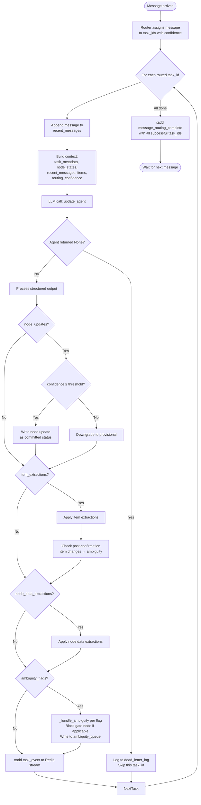
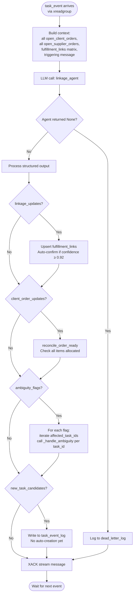
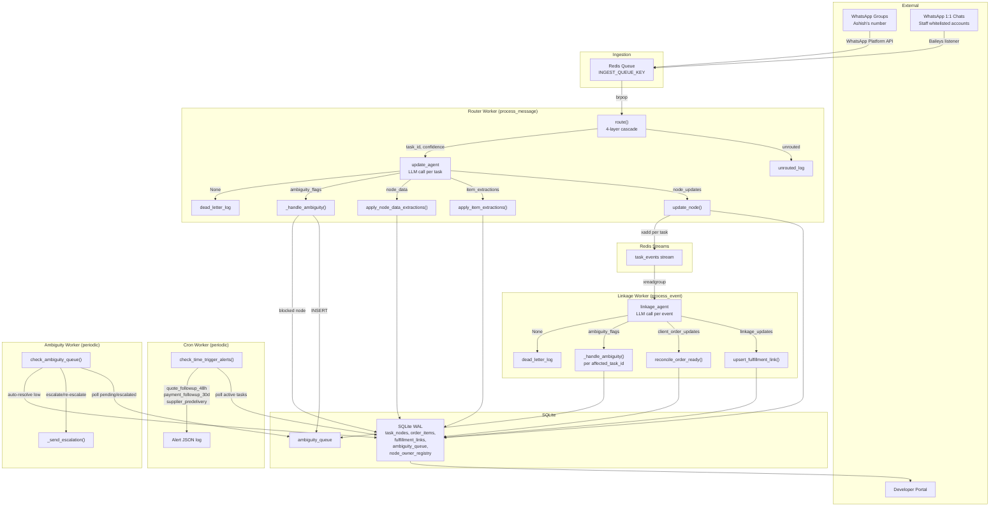

# Agent Architecture Specification

**Workflow:** architecture
**Date:** 2026-03-30

---

## Implementation Update

### Current State (as of Sprint 3)

Two production LLM paths, both implemented and running:

1. **`update_agent`** — per-task, per-message state updater. One LLM call per `(message, task_id)` pair. Handles non-deterministic node state transitions, item extraction, ambiguity escalation. Quality risk: 8/10.

2. **`linkage_agent`** — cross-order M:N fulfilment coordinator. One LLM call per message, seeing ALL open orders simultaneously. Handles item-level supplier↔client matching, dispatch gating. Quality risk: 9/10.

Two eval-only LLM calls (`eval_agent`, `eval_judge`) are tooling and explicitly not production architecture.

### Key fixes since context management workflow
- `routing_confidence` now passed through to `update_agent` (was dropped)
- `prune_links_for_supplier_order` / `prune_links_for_client_order` implemented and tested — task closure cascade now works
- 118 unit tests passing

### Open backlog items
- Backlog #1: Node state confidence stripped in `update_agent` context — model cannot distinguish confidence levels of provisional nodes
- Eval vs. prod context gap — test scores from monolithic `eval_agent` don't cleanly transfer to modular prod behaviour

### Batching: current state and architectural significance

**Current state: zero batching in either path.**

- `update_agent` path: `r.brpop()` pops one message at a time; one immediate LLM call per routed task per message
- `linkage_agent` path: `xreadgroup(count=10)` reads up to 10 events in one Redis call but processes them sequentially — one LLM call per event

**Why batching matters for cost:** Both paths make one LLM call per message regardless of message significance. Most WhatsApp messages in the business don't trigger meaningful state changes — noise, acknowledgements, conversations. Every one still costs a full LLM call.

**Batching design considerations:**

| Path | Batching potential | Primary risk |
|---|---|---|
| `update_agent` | Medium — harder. Messages to the same task often chain ("cancel that", "same as before"). Model must resolve ordering and causality within batch. | Correctness degrades at larger batch sizes for chained corrections |
| `linkage_agent` | High — natural fit. Model already sees ALL open orders and full fulfilment matrix. `new_message` → `new_messages[]` is a minimal schema change. Linkage reasoning is matrix-state-driven, not conversationally threaded. | Low for small batches; worth empirical testing for large batches |

**Quiet hours opportunity:** Update latency tolerance varies by node type:
- `order_confirmation`, `dispatched`, `order_ready` — latency-sensitive; wrong state for hours is operationally risky
- Payment logging, enquiry tracking, status notes — could tolerate 4–6 hour quiet-hours batches without business impact

**Open design question:** What is the largest batch size at which `update_agent` and `linkage_agent` quality (measured by node state accuracy and link match accuracy) does not degrade? This is empirically testable with the existing eval infrastructure. Until tested, quiet-hours batching should be limited to `linkage_agent` only, and to batches of ≤5 messages per call as a conservative starting point.

---

## Context Domain Clustering

### LLM Call × Context Field Matrix

| Context field | `update_agent` | `linkage_agent` | `eval_agent` | `eval_judge` |
|---|:---:|:---:|:---:|:---:|
| task_metadata | ✓ | | | |
| task_template_nodes | ✓ | | | |
| current_node_states | ✓ | | | |
| recent_messages | ✓ | | | |
| order_items | ✓ | (via open_orders) | | |
| routing_confidence | ✓ | | | |
| new_message | ✓ | ✓ | | |
| open_client_orders | | ✓ | | |
| open_supplier_orders | | ✓ | | |
| fulfillment_links | | ✓ | | |
| raw_message_thread | | | ✓ | |
| eval_agent_output | | | ✓ | ✓ |
| expected_output | | | | ✓ |

`update_agent` and `linkage_agent` share only `new_message` — every other field is distinct. They reason about different objects.

### Identified Clusters

**Cluster 1 — Per-task state tracking**
- Calls: `update_agent`
- Reasoning focus: *"What just happened in this specific task, and how should the node states change?"*
- Context scope: task-scoped, message-triggered
- Memory model: node states in SQLite are the persistent working memory between invocations

**Cluster 2 — Cross-order coordination**
- Calls: `linkage_agent`
- Reasoning focus: *"Which supplier items satisfy which client items, across all open orders?"*
- Context scope: system-wide (all open orders simultaneously)
- Memory model: fulfillment_links table; stateless between calls except via DB reads

**Cluster 3 — Eval tooling**
- Calls: `eval_agent` + `eval_judge`
- Reasoning focus: *"Does this agent output match the expected task tree?"*
- Direct output→input dependency: eval_agent produces output that eval_judge scores
- Explicitly offline/batch — not production architecture

### Shared Context Services
None at the LLM call level. Router, ambiguity writer, and task pruning are all deterministic Python — not LLM calls.

### Clustering Summary
- 2 production clusters (each containing exactly 1 LLM call)
- 1 eval-only cluster (2 LLM calls with direct dependency)
- 0 shared LLM services
- The two production clusters are confirmed by the participant as **fully separate concerns**, not aspects of a unified agent

---

## Agent vs Service Classification

### 3-Question Test Results

| Question | Task State Agent (`update_agent`) | Fulfilment Coordination Agent (`linkage_agent`) |
|---|---|---|
| Evolving state across multiple steps? | ✅ Yes — node states persist and evolve across days of messages | ✅ Yes — fulfillment_links matrix evolves across order lifecycle |
| Chooses between multiple possible next actions? | ⚠️ Partial — within single call: update nodes / raise flags / extract items / emit candidates / do nothing | ⚠️ Partial — within single call: upsert links / update order_ready / raise flags / emit candidates / do nothing |
| Stable object of concern over time? | ✅ Yes — the task (specific client or supplier order) | ✅ Yes — the fulfilment state of all open orders |

Both score 2/3 (with partial on Q2) → **both are Agents**.

### Final Architecture Overview

**Agent-based architecture with 2 production agents and 1 eval service.**

### Agents

**Agent 1: Task State Agent** (`update_agent`)
- Scope: per-task, per-message state tracking
- Quality risk connection: 8/10 — wrong node state → wrong dispatch decision downstream
- Output effects: node_updates, item_extractions, node_data_extractions, ambiguity_flags, new_task_candidates (5 output types)
- **Higher gross failure rate** — two compounding factors: (1) more output paths means more ways to be wrong per call, and (2) higher call frequency — a message routed to N tasks fires N `update_agent` calls vs 1 `linkage_agent` call. Primary target for test coverage and observability.

**Agent 2: Fulfilment Coordination Agent** (`linkage_agent`)
- Scope: cross-order M:N matrix coordination
- Quality risk connection: 9/10 — false positive dispatch is potentially irreversible
- Output effects: linkage_updates, client_order_updates, ambiguity_flags, new_task_candidates (4 output types)
- Lower gross failure rate but higher per-failure consequence — a single false positive on `order_ready` is operationally irreversible if goods leave the warehouse.

### Services

**Eval Tooling** (`eval_agent` + `eval_judge`)
- Offline batch; no evolving state; fixed input→output sequence
- Explicitly not production architecture

### Scope Check
- 2 agents — within manageable limit
- No deferred agent candidates
- Both agents are equal in strategic importance; asymmetric in failure profile:
  - Task State Agent: higher frequency of failures (more output types × higher call frequency per message)
  - Fulfilment Coordination Agent: higher severity of failures (irreversible consequences per failure)

---

## Architecture Validation

### Validation Checks

**Check 1: Circular dependencies** ✅
`update_agent` → `task_events` stream → `linkage_agent`. One-directional. `linkage_agent` writes `order_ready` back to DB, but `update_agent` reads that on the next message, not the same invocation. No circular dependency.

**Check 2: Unclear context ownership** ⚠️ Resolved — see below
Both agents write to `task_nodes` but for different node types. Split is implicit in the code; needs explicit enforcement across 4 layers (see resolution).

**Check 3: Orphaned context** ✅
`new_task_candidates` emitted by both agents is intentionally deferred to `task_event_log` (no auto-creation yet). All other fields have clear producers. No orphaned context.

**Check 4: Missing handoff paths** ⚠️ Resolved — see below
`linkage_agent` ambiguity flags were only `log.warning()`'d in `linkage_worker.py`. They never reached `ambiguity_queue` and never triggered gate blocking or escalation. Asymmetric handling vs `update_agent`.

**Check 5: Agent/service misclassification** ✅
Router, cron worker, ambiguity worker are deterministic code — correctly not agents. Eval tooling correctly a service. No misclassifications.

### Issues and Resolutions

**Issue 1: Linkage ambiguity flags not escalated (Medium)**

`LinkageAmbiguityFlag` and `AmbiguityFlag` are structurally identical. Resolution: import and call `_handle_ambiguity()` from `worker.py` in `linkage_worker.py` for each flag, same as `update_agent` path. No separate escalation mechanism needed.

`task_id` to pass: if flag references a specific order, use that order's ID; for cross-order flags, use the triggering event's `task_id`.

**Issue 2: Implicit node ownership between agents (Low — but important for maintainability)**

Both agents write to `task_nodes` for different node types. Ownership to be made explicit across 4 layers:

1. **DB schema** — new `node_owner_registry` table:
   ```sql
   CREATE TABLE IF NOT EXISTS node_owner_registry (
       node_id       TEXT NOT NULL,
       order_type    TEXT NOT NULL,
       owner_agent   TEXT NOT NULL,   -- 'update_agent' | 'linkage_agent'
       ownership_type TEXT NOT NULL   -- 'exclusive_write' | 'read_only'
   );
   ```
   Makes ownership queryable and auditable at runtime.

2. **Static metadata** — add `owner` field to each node definition in `templates.py`:
   ```python
   {"id": "order_ready",        "owner": "linkage_agent", ...}
   {"id": "order_confirmation", "owner": "update_agent",  ...}
   {"id": "task_closed",        "owner": "linkage_agent", ...}
   ```
   Ownership travels with the template — source of truth for node-level decisions.

3. **Code annotations** — docstrings in `update_node()` (task_store.py), `worker.py`, and `linkage_worker.py` marking agent→node ownership boundaries explicitly.

4. **Function naming** — `update_node()` already has `updated_by` param (`"agent"` or `"linkage_worker"`). Promote to typed constants or thin wrappers:
   - `update_node_as_update_agent(...)` — call site makes ownership visible
   - `update_node_as_linkage_agent(...)` — violations catch-able in code review

### Approved Architecture Snapshot

- **Task State Agent** (`update_agent`): owns all message-driven node transitions; routes ambiguity via `_handle_ambiguity()`
- **Fulfilment Coordination Agent** (`linkage_agent`): owns all fulfilment-derived node transitions (order_ready, task_closed); routes ambiguity via same `_handle_ambiguity()` — no separate mechanism
- **Shared infrastructure**: `ambiguity_queue`, `task_event_log`, `node_owner_registry` (new)
- **Handoff**: update_agent → Redis `task_events` stream → linkage_agent (one-directional, sequential per message)

### Refined Designs (from validation discussion)

**1. Linkage ambiguity escalation with `affected_task_ids`**

`LinkageAmbiguityFlag` gains `affected_task_ids: list[str]` (required for blocking flags, optional for non-blocking). When linkage_worker receives flags from `run_linkage_agent`:
- For each flag, iterate over `affected_task_ids` and call `_handle_ambiguity()` once per task_id
- For non-blocking flags with empty `affected_task_ids`, fall back to message_id matching against the `task_events` stream to find the originating task_id
- Prompt instruction enforces that blocking flags must include at least one task_id

**2. `message_routing_complete` event type**

`router/worker.py` restructured: after iterating all routed tasks for a message, emit a single `message_routing_complete` event to `task_events` stream with `affected_task_ids: list[str]` — the set of all task_ids that were successfully updated. This gives linkage_worker a reliable per-message task_id set without depending on ordering of individual task_event records.

**3. Dead-letter handling for update_agent failures**

Current silent failure: `run_update_agent` returns `None` on API failure (3 retries exhausted) or JSON/Pydantic validation failure. The message is already appended to recent_messages before the agent call, creating split state (message stored, nodes not updated).

Design: log failed `(message_id, task_id, failure_reason)` to a `dead_letter_log` table. Do not re-queue — context length exceeded is a permanent failure, and API failures after 3 retries are unlikely to succeed on retry. Dead letters surface in dashboard for human review.

**4. Context length guard (backlog)**

Neither agent path currently validates that assembled context fits within model context window. Context length exceeded = permanent failure (can't retry with same context). Needs either:
- Runtime guard: measure token count before API call, truncate or fail gracefully
- Provable analysis: static upper bound on context size given DB constraints

---

## Agent Control Logic

### Control Flow: Task State Agent (`update_agent`)



### Control Flow: Fulfilment Coordination Agent (`linkage_agent`)



### What makes these agents agentic

Both agents share the pattern:
1. **Persistent state across invocations** — node_states / fulfillment_links survive between calls and accumulate over the order lifecycle (days/weeks)
2. **Non-deterministic action selection** — within a single call, the LLM chooses which combination of the 4-5 output types to emit (including "do nothing")
3. **Stable object of concern** — each call reasons about the same task/fulfilment matrix, not a fresh context

Neither agent has an internal multi-step loop. They are **event-driven single-shot agents with persistent external state**, not iterative planners.

### AgentContext Schemas

**Task State Agent:**
| Field | Classification | Type |
|---|---|---|
| task_metadata | input-only | dict (id, order_type, entity_name) |
| task_template_nodes | input-only | list (node definitions for order_type) |
| current_node_states | input-only | list (current status of each node) |
| recent_messages | input-only | list (last N messages for this task) |
| new_message | input-only | dict (triggering message) |
| order_items | input-only | list (current item list) |
| routing_confidence | input-only | float (router's confidence score) |
| node_updates | agent-owned | list[NodeUpdate] |
| item_extractions | agent-owned | list[ItemExtraction] |
| node_data_extractions | agent-owned | list[NodeDataExtraction] |
| ambiguity_flags | agent-owned | list[AmbiguityFlag] |
| new_task_candidates | agent-owned | list[NewTaskCandidate] |

No internal loop state — single-shot agent.

**Fulfilment Coordination Agent:**
| Field | Classification | Type |
|---|---|---|
| open_client_orders | input-only | list (all open client orders with items) |
| open_supplier_orders | input-only | list (all open supplier orders with items) |
| fulfillment_links | input-only | list (current M:N allocation matrix) |
| new_message | input-only | dict (triggering event) |
| linkage_updates | agent-owned | list[LinkageUpdate] |
| client_order_updates | agent-owned | list[ClientOrderUpdate] |
| ambiguity_flags | agent-owned | list[LinkageAmbiguityFlag] (with affected_task_ids) |
| new_task_candidates | agent-owned | list[NewTaskCandidate] |

No internal loop state — single-shot agent.

### Error Handling

| Failure | update_agent | linkage_agent |
|---|---|---|
| API failure (3 retries) | → None → dead_letter_log | → None → dead_letter_log |
| JSON/Pydantic parse failure | → None → dead_letter_log | → None → dead_letter_log |
| Context length exceeded | → permanent failure → dead_letter_log + alert | → permanent failure → dead_letter_log + alert |
| Partial output | All-or-nothing; structured output guarantees schema | Same |
| Downstream DB write fails | Transaction rollback; message already appended (split state risk) | Transaction rollback; XACK not sent → redelivery |

Key asymmetry: update_agent has the split-state risk (message appended before agent call), linkage_agent does not (XACK only after successful processing).

---

## Service Composition

### System-wide data flow



### Ingestion: dual-source design

- **WhatsApp Platform API** (primary): group messages via Ashish's number (must be a member of each monitored group). Official Meta API — no ban risk. Requires Meta Business verification (backlog item #6, deadline Apr 18).
- **Baileys** (secondary): 1:1 chats from whitelisted staff accounts. Unofficial library — ban risk on individual numbers. Limited to specific accounts opted in by Ashish and staff.

Both sources produce the same message format into `INGEST_QUEUE_KEY`. The router is source-agnostic.

### Orchestration pattern

Event-driven pipeline with two periodic pollers. No central orchestrator.

| Component | Trigger | Pattern |
|---|---|---|
| Router Worker | `brpop` from Redis queue | Event-driven, sequential |
| update_agent | Called by Router Worker per routed task | Agent-driven (worker orchestrates) |
| Linkage Worker | `xreadgroup` from `task_events` stream | Event-driven, sequential |
| linkage_agent | Called by Linkage Worker per stream event | Agent-driven (worker orchestrates) |
| Cron Worker | Timer interval | Periodic poller |
| Ambiguity Worker | Timer interval | Periodic poller |

### Component integration points

**1. Router Worker → Linkage Worker** (one-directional, async)
- Medium: Redis `task_events` stream
- Data: `{event_type, task_id, message_id, message_json}`
- New: `message_routing_complete` event with `affected_task_ids` list
- Decoupled: linkage_worker has no back-channel to router_worker

**2. Both agents → Ambiguity Worker** (one-directional, async)
- Medium: SQLite `ambiguity_queue` table
- Data: ambiguity flag with severity, category, blocking_node_id, escalation_target
- Decoupled: ambiguity_worker polls independently on timer

**3. Cron Worker → Alert system** (one-directional)
- Medium: JSON alert log + `task_alerts_fired` dedup table
- Independent of both agents — reads only node states and node_data from DB

**4. All workers → SQLite** (shared persistence)
- WAL mode allows concurrent reads; writers serialise
- Node ownership enforced by `node_owner_registry` + wrapper functions

### Deterministic services (not agents)

| Service | Stateless? | Called by | Purpose |
|---|---|---|---|
| `route()` | Yes | Router Worker | 4-layer cascade: noise filter → group map → entity match → (stub: embedding → LLM) |
| `_handle_ambiguity()` | Yes | Both workers | Gate blocking + ambiguity_queue INSERT |
| `_check_post_confirmation_item_changes()` | Yes | Router Worker | Post-confirmation item change detection → ambiguity |
| `apply_item_extractions()` | Yes | Router Worker | Merge item changes into order_items |
| `apply_node_data_extractions()` | Yes | Router Worker | Write structured data to node_data |
| `upsert_fulfillment_link()` | Yes | Linkage Worker | Insert/update M:N allocation matrix |
| `reconcile_order_ready()` | Yes | Linkage Worker | Check all client items allocated → set order_ready |
| `prune_links_for_*_order()` | Yes | Both workers (on task close) | Cascade-clean fulfilled links |
| `_send_escalation()` | Yes | Ambiguity Worker | Format + dispatch escalation message |
| `_evaluate_time_trigger()` | Yes | Cron Worker | Check time conditions per node type |

All are pure functions or single-transaction DB operations — no evolving state, no branching decisions.

### Architecture composition summary

- **2 agents** (update_agent, linkage_agent) — LLM-powered, persistent state
- **10 deterministic services** — stateless, called by workers
- **4 workers** — event loops that orchestrate agent calls and service invocations
- **2 ingestion sources** — WhatsApp Platform API (groups) + Baileys (whitelisted 1:1 chats)
- **1 shared persistence layer** — SQLite WAL
- **1 async handoff** — Redis `task_events` stream (router → linkage, one-directional)
- **1 shared queue** — `ambiguity_queue` table (both agents → ambiguity worker)
- **0 circular dependencies** — all data flows are acyclic
